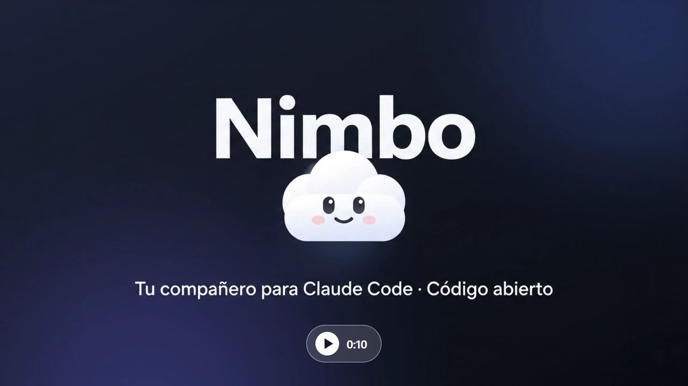
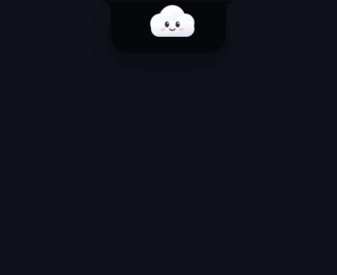

# Nimbo ☁️

[English](README.md) · **Español**

Un compañero flotante para [Claude Code](https://claude.com/claude-code) en Windows. Vive en el borde de arriba de tu pantalla, te muestra qué está haciendo cada uno de tus chats y te deja aprobar permisos sin ir a la terminal.

No necesita API key: usa el `claude` que ya tienes instalado y con sesión iniciada.

[](promo/nimbo-intro.mp4)

*▶ Haz clic para ver la intro (10 s). Es un video conceptual generado con IA; la interfaz real es la de abajo.*



## Instalar

1. Descarga **[Nimbo-Setup.exe](https://github.com/FedericoChalaca/nimbo/releases/latest/download/Nimbo-Setup.exe)** y ábrelo.
2. Windows puede mostrar "Windows protegió su PC" porque el instalador no está firmado. Elige **Más información → Ejecutar de todas formas**.
3. Nimbo se abre y muestra el panel **Conexiones**. Pulsa **Conectar** junto a Claude Code y listo.

No necesitas Node.js. Sí necesitas Claude Code instalado y con sesión iniciada (`claude` en una terminal).

Para quitarlo, desinstala Nimbo desde Configuración de Windows → Aplicaciones. El desinstalador también quita los hooks de Nimbo de Claude Code; tus ajustes en `%APPDATA%
imbo` se conservan.

> Nimbo usa el idioma de tu Windows (español o inglés). Cámbialo cuando quieras: clic derecho → **Idioma / Language**.

## Conectar todo

Clic derecho en Nimbo → **Conexiones y ajustes** (la primera vez se abre solo). Cada fila tiene un punto verde o ámbar y un botón.

| Conexión | Qué te da | Cómo se conecta |
|---|---|---|
| **Claude Code** | Tus chats en vivo y las tarjetas de permiso | Pulsa **Conectar**. Agrega los hooks de Nimbo a `~/.claude/settings.json` (antes hace una copia con fecha y no toca tus otros hooks). **Desconectar** los quita. |
| **Tu nombre** | Un saludo con tu nombre | Escríbelo en la casilla. |
| **GitHub** | Una píldora con tus notificaciones sin leer | Instala [GitHub CLI](https://cli.github.com) y corre `gh auth login`. Nimbo usa esa sesión. |
| **Trello** | Una píldora con tus tarjetas pendientes | Activa el conector de Trello en [claude.ai → Ajustes → Conectores](https://claude.ai/settings/connectors) y pulsa **Probar** (tarda cerca de un minuto). |
| **WhatsApp** | Chats sin leer, quién escribió y qué es urgente | Abre WhatsApp de escritorio. Para los resúmenes, pulsa **Activar** (ver [WhatsApp](#whatsapp-opcional-solo-lectura)). |
| **Iniciar con Windows** | Nimbo arranca al prender el equipo | Pulsa **Activar**. |

## Qué hace

- **Ve tus chats en vivo.** Reacciona a cada sesión de Claude Code (varias a la vez): pensando, trabajando, esperándote, listo o error. Muestra el paso actual y el diff o la terminal del chat activo.
- **Aprueba permisos desde la isla.** Permitir, Denegar, Siempre o mandarlo a la terminal. La tarjeta muestra el comando completo.
- **Chatea con tu Claude.** Escribe, dicta (Whisper local, el audio no sale de tu PC), pega imágenes o suéltale archivos encima.
- **Orquesta.** Conoce tus chats: si pides algo que le toca a otro proyecto, redacta el prompt para ese chat y lo envía solo cuando tú confirmas.
- **Recordatorios.** "Recuérdame mañana a las 9 enviar la factura": avisa en la isla y con una notificación de Windows.
- **Dos apariencias.** Una nube con cara o una esfera de puntos estilo JARVIS.
- **Modo mini.** `Ctrl+Alt+N` lo encoge a una esquina para cuando juegas.
- **Se mueve.** Arrástralo por el borde de arriba; recuerda dónde lo dejaste.

## Usarlo

| Acción | Qué pasa |
|---|---|
| Pasar el mouse | Aparecen las píldoras (Chats, Trello, GitHub, WhatsApp, Pendientes). Toca una para ver su detalle. |
| Un clic | Abre o cierra el chat. |
| Clic derecho | Menú: conexiones, idioma, apariencia, modo mini, WhatsApp, silenciar, salir. |
| Arrastrar la barra | Lo mueve por el borde de arriba. |
| Soltar un archivo encima | Se lo "come" y lo adjunta al chat. |
| `Ctrl+Alt+N` | Modo mini. |

## WhatsApp (opcional, solo lectura)

Apagado por defecto. Nimbo siempre muestra cuántos chats tienes sin leer (lo lee del título de la ventana de WhatsApp de escritorio). Si activas **Leer mensajes de WhatsApp**:

- Lee las notificaciones de WhatsApp que Windows ya te mostró, con la API oficial de Windows. No abre tu sesión de WhatsApp, no usa librerías no oficiales, y nunca envía ni marca nada como leído.
- Le pasa esos textos a **tu** Claude para que diga quién escribió, qué es trabajo, qué grupos ignorar y qué es urgente. Lo urgente hace sonar una alarma roja, distinta.
- Tú defines qué es trabajo y qué grupos ignorar en un archivo de texto: clic derecho → **Reglas de WhatsApp**.
- **¿Lo quieres 100 % local?** Si [Ollama](https://ollama.com) está abierto con un modelo de texto pequeño (por ejemplo `ollama pull llama3.2:3b`), Nimbo lo usa en vez de Claude: cerca de un segundo por chat, sin gastar tokens, y los mensajes no salen de tu PC (si el modelo local falla, ese chat queda sin etiqueta; no se manda a Claude). El panel Conexiones muestra quién está resumiendo.

Quién ve tus mensajes: solo tu propio Claude. Nimbo no tiene servidores ni telemetría, así que nada llega al autor de Nimbo ni a nadie más. Al activarlo, el texto de esas notificaciones (escrito por otras personas) se envía a Anthropic a través de **tu** cuenta de Claude para clasificarlo, igual que cualquier cosa que le escribes a Claude. Nimbo lo guarda solo en memoria, nunca en disco, y lo olvida cuando WhatsApp marca todo como leído. Solo ve los chats que dejaron notificación (los silenciados no).

Está apagado hasta que tú lo actives, y se apaga con un clic.

## Seguridad

Nimbo se sienta entre tú y los permisos de Claude Code, así que esto importa:

- El servidor local solo escucha en `127.0.0.1` y solo acepta mensajes firmados (HMAC-SHA256) por `hook.js` con un secreto que cambia en cada arranque. Una página web u otro programa no puede aprobar comandos por ti.
- La tarjeta de permiso muestra el comando o el cambio completo. Lee antes de permitir.
- El chat de Nimbo solo puede leer archivos. Para cambiar algo en un proyecto, te propone un prompt y lo envía únicamente cuando haces clic.
- Los resúmenes de Trello y WhatsApp corren sin herramientas: un texto ajeno no puede hacer que Claude ejecute nada.
- Nimbo no guarda contraseñas, tokens ni API keys. GitHub usa tu sesión de `gh`; Trello, el conector de tu Claude.

Si encuentras un problema de seguridad, abre un issue.

## Correrlo desde el código

Requiere [Node.js](https://nodejs.org) 20 o superior.

```bash
git clone https://github.com/FedericoChalaca/nimbo.git
```

```bash
cd nimbo
```

```bash
npm install
```

```bash
npm start
```

Después conecta Claude Code desde el panel Conexiones (o con `npm run install-hooks`).

Otros comandos: `npm test`, `npm run dist` (arma el instalador), `npm run promo` (graba el video de demostración), `npm run promo:gif` (regenera el GIF de arriba).

Tus ajustes viven en `%APPDATA%\nimbo\`, nunca en la carpeta del proyecto. Los textos de la interfaz están en `i18n.js` (español en el código, inglés en ese archivo). `CLAUDE.md` explica la arquitectura, los flujos y las lecciones aprendidas (sirve tanto a personas como a Claude Code).

Si tu `claude.exe` no está donde lo dejan npm o el instalador nativo, define la variable de entorno `NIMBO_CLAUDE` con su ruta.

## Créditos

La idea y varias técnicas de la interfaz de isla vienen de [Coucou](https://github.com/louis-cfm/coucou) de Louis Raillé (MIT), un compañero para la muesca del Mac. Nimbo es una implementación independiente para Windows, con su propio personaje, sonidos y código.

## Licencia

MIT. Ver [LICENSE](LICENSE) y [NOTICE.md](NOTICE.md).
